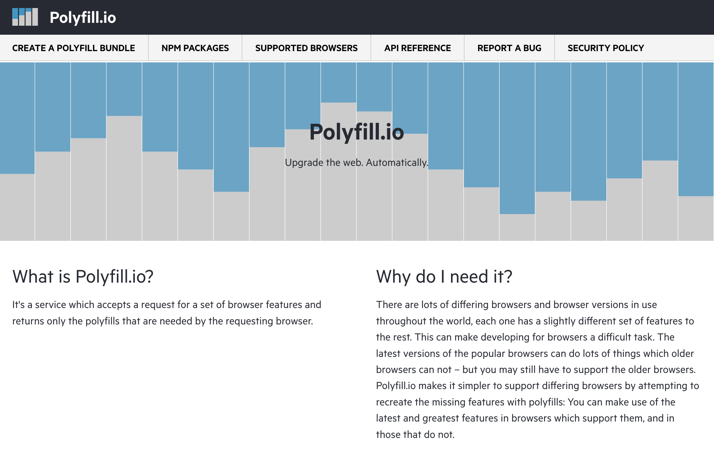
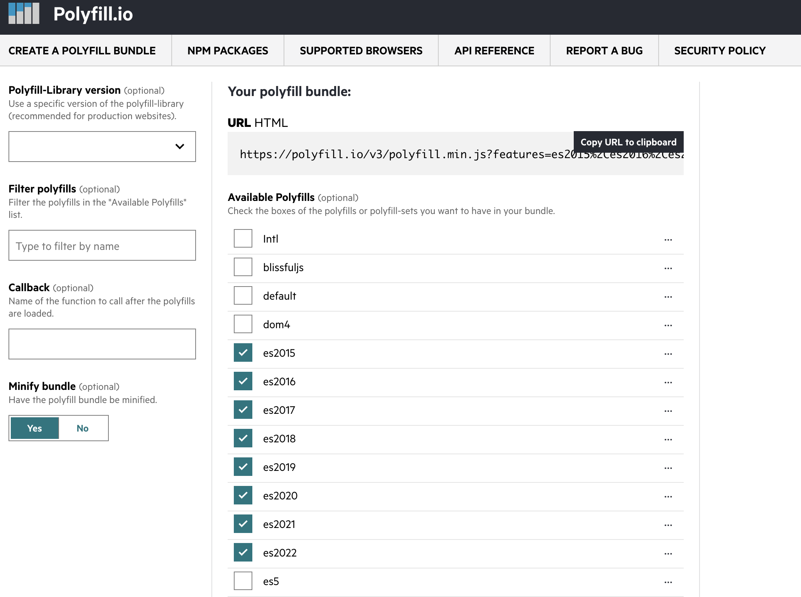

# 在项目中落地 polyfill.io

[polyfill.io](https://polyfill.io/ 'polyfill.io')是一个根据浏览器 UA 自动生成 polyfill 的服务，polyfill.io 是[开源的](https://github.com/financial-times/polyfill-service 'polyfill-service')，我们可以直接使用 polyfill.io 默认提供的服务，也可以自己部署。使用 polyfill.io 这样的服务主要是用来减小打包生成文件大小，让用户尽可能的减小文件加载。

## 改造项目

通常我们的项目都是通过脚手架创建的，例如使用 [vue-cli](https://cli.vuejs.org/zh/ 'vue-cli') 或者 [create-react-app](https://create-react-app.dev/ 'create-react-app') 等。这些脚手架基本都使用 babel 来把 js 的新语法转换为 es5，同时也会根据源码中的使用的 js 新特性自动生成一些 polyfill。一份常见的`babel.config.js`文件如下：

```js
module.exports = {
  presets: [
    [
      '@babel/preset-env',
      {
        useBuiltIns: 'usage' // 配合 browserslist 配置，自动填充相关兼容代码，新版本babel主要会添加core-js的引用
      }
    ]
  ]
}
```

改造第一步，在 polyfill.io 上选择需要的特性，然后复制 js 链接到 HTML 中。



```html
<!DOCTYPE html>
<html>
  <head>
    <meta charset="UTF-8" />
    <meta http-equiv="X-UA-Compatible" content="IE=edge" />
    <meta name="viewport" content="width=device-width, initial-scale=1.0" />
    <title>DEMO</title>
    <script src="https://polyfill.io/v3/polyfill.min.js?features=es2016%2Ces2017%2Ces2018%2Ces2019%2Ces2020%2Ces2021%2Ces2022%2CResizeObserver%2Ces2015"></script>
  </head>
  <body>
    <!-- 其他内容 -->
  </body>
</html>
```

那么如果我们直接在 HTML 中引入 polyfill.io，就可能会导致同一个 polyfill 存在两份。所以我们需要把`useBuiltIns`修改为`false`。

然后我们开始打包项目。既然做了修改，那我们就对比一下打包生成的 js 的大小吧，一比较才发现，修改后的文件竟然比修改前的足足大了几百 KB。


对打包生成的文件进行分析发下，文件里面生成了很多重复的代码，例如源码为：

```js
export default class Hello {
  constructor() {
    console.log('Hello')
  }

  sayHi() {
    console.log('Hi')
  }
}
```

生成后的文件为：

```js
'use strict'

Object.defineProperty(exports, '__esModule', {
  value: true
})
exports.default = void 0

function _classCallCheck(instance, Constructor) {
  if (!(instance instanceof Constructor)) {
    throw new TypeError('Cannot call a class as a function')
  }
}

function _defineProperties(target, props) {
  for (var i = 0; i < props.length; i++) {
    var descriptor = props[i]
    descriptor.enumerable = descriptor.enumerable || false
    descriptor.configurable = true
    if ('value' in descriptor) descriptor.writable = true
    Object.defineProperty(target, descriptor.key, descriptor)
  }
}

function _createClass(Constructor, protoProps, staticProps) {
  if (protoProps) _defineProperties(Constructor.prototype, protoProps)
  if (staticProps) _defineProperties(Constructor, staticProps)
  return Constructor
}

var Hello = /*#__PURE__*/ (function() {
  function Hello() {
    _classCallCheck(this, Hello)

    console.log('Hello')
  }

  _createClass(Hello, [
    {
      key: 'sayHi',
      value: function sayHi() {
        console.log('Hi')
      }
    }
  ])

  return Hello
})()

exports.default = Hello
```

我们可以看到生成的文件中包含了`_classCallCheck`、`_defineProperties`、`_createClass`等内容，检查多个文件后发现，每个包含`class`的源文件生成的代码都包含了前面的这几个函数，他们之间没有被复用。


为啥 helper 函数不能被复用呢？这里和`@babel/plugin-transform-runtime`这个插件有关，这个插件的官方文档是这样说的，`_A plugin that enables the re-use of Babel's injected helper code to save on codesize.（一个可以重复使用 Babel 的注入的 helper 代码来节省代码大小插件。）_”，经过一番文档查阅，变更后的 babel 配置如下：

```js
module.exports = {
  presets: [
    [
      '@babel/preset-env',
      {
        useBuiltIns: false // 不注入polyfill
      }
    ]
  ],
  plugins: [
    [
      '@babel/plugin-transform-runtime',
      {
        absoluteRuntime: false,
        // 不使用 @babel/runtime-corejs2 或 @babel/runtime-corejs3，这里不设置就是用 @babel/runtime
        corejs: false,
        helpers: true,
        // generator 相关的运行时helper
        regenerator: true,
        // version 不同，复用的helper范围会不一样，请使用最新版本@babel/runtime，版本越新，helper会越多，默认7.0.0-beta.0
        version: require('@babel/runtime/package.json').version
      }
    ]
  ]
}
```

注意：`@babel/plugin-transform-runtime`不能当做 polyfill 去使用，它主要是提供一些**babel 编译**helper，例如语法层面的转换函数；polyfill 是提供一些兼容 API，例如`Array.prototype.flat`等。这是`@babel/plugin-transform-runtime`官方给的提示。

> NOTE: Instance methods such as "foobar".includes("foo") will only work with core-js@3. If you need to polyfill them, you can directly import "core-js" or use @babel/preset-env's useBuiltIns option.

## 结论

改造为使用 polyfill.io 需要修改`@babel/preset-env`的`useBuiltIns`参数来禁止自动填充 polyfill，并且要使用`@babel/plugin-transform-runtime`来复用 babel 编译过程中生成的 helper 函数
