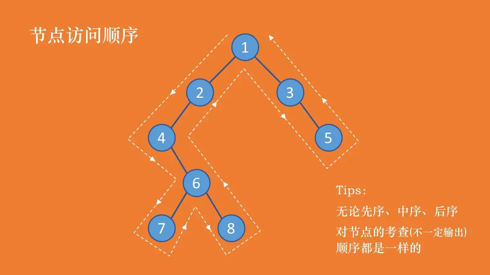

# 二叉树

在计算机科学中，二叉树（英语：Binary tree）是每个节点最多只有两个分支（即不存在分支度大于 2 的节点）的树结构。通常分支被称作“左子树”或“右子树”。

## 二叉树遍历

### 先序遍历

先遍历自己，然后再遍历左节点，最后遍历右节点

<<< @/docs/算法与数据结构/二叉树/preorderTraversal.js

### 中序遍历

先遍历左节点，然后再遍历自己，最后遍历右节点

<<< @/docs/算法与数据结构/二叉树/middleOrderTraversal.js

### 后序遍历

先遍历左节点，然后再遍历右节点，最后遍历自己

<<< @/docs/算法与数据结构/二叉树/postorderTraversal.js

## 广度优先遍历

广度优先遍历即为，二叉树一层一层的遍历。

<<< @/docs/算法与数据结构/二叉树/breadthTraversa.js

## 计算二叉树深度

获得二叉树深度

<<< @/docs/算法与数据结构/二叉树/depth.js

## 目录

- [二叉树遍历](./binaryTree.js)
- [AVL 树](./avl.js)
- [字典树](./trie.js)
